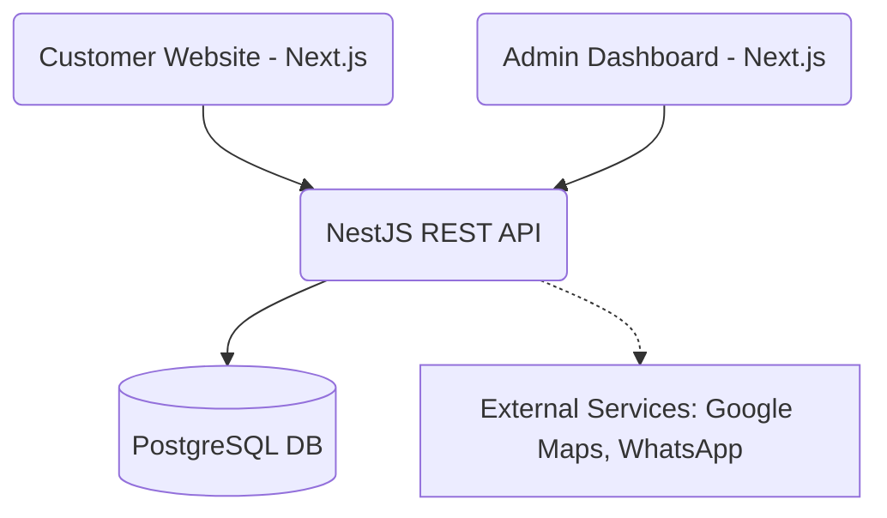

# Udan Cabs Architecture

Udan Cabs uses a decoupled, modular architecture designed for high scalability and maintainability.

## High-Level Architecture

## Backend Architecture (NestJS)

The backend follows a Feature-Based Modular Architecture. Each domain feature (e.g., Booking, Vehicle, Driver) is encapsulated within its own module under `src/modules/`.

- **Controllers**: Handle incoming HTTP requests and map them to services. Contain no business logic.
- **Services**: Contain all business logic.
- **DTOs**: Data Transfer Objects used for request validation (using class-validator).
- **Entities**: Represent the structure of data (mostly handled by Prisma schemas).

### Global Configurations
- **Validation Pipe**: Ensures all incoming data matches defined DTOs.
- **Exception Filters**: Maps unhandled errors to standard JSON responses.
- **Interceptors**: Wraps outgoing responses (e.g., standardized success payload format).
- **Prisma**: Serves as the ORM to interact with PostgreSQL.

## Frontend Architecture (Next.js)

Both frontends (Client and Admin) use a unified architecture pattern.

- **App Router**: Uses Next.js 14+ App Router for file-based routing.
- **Components**: Separated into generic UI components (Shadcn) and domain-specific feature components.
- **State Management**: TanStack Query (React Query) handles server state, data fetching, caching, and mutation.
- **Styling**: Tailwind CSS combined with Shadcn/UI for a highly customizable and modern UI system.

## Database (PostgreSQL)

Uses Prisma for schema definitions and migrations. Relational integrity is enforced at the database level.
